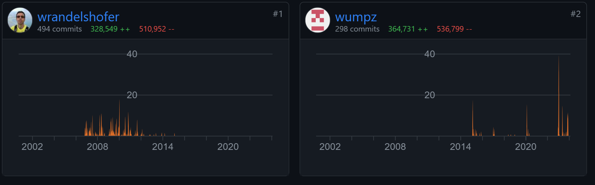
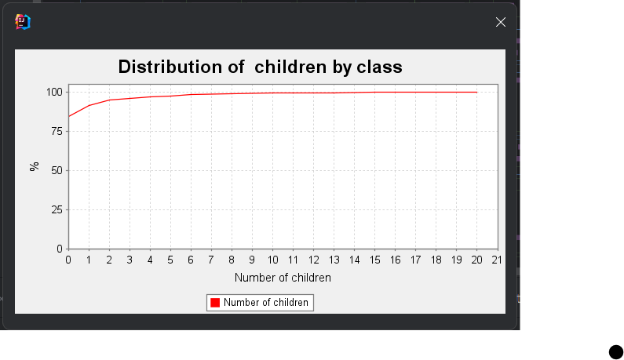
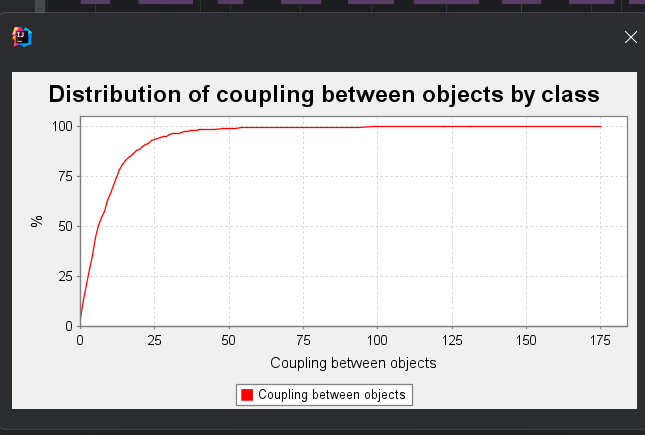

# jhotdraw projet

# Génie logiciel

# Author: PHAM Tuan Anh && Kode Ousmane Omar

# Groupe: 5

# Projet sélectionné : JHotDraw

`Lien du projet :  https://github.com/wumpz/jhotdraw`

## config Sonarqube

```
docker run -d --name sonarqube -p 9000:9000 sonarqube:8-community

mvn org.jacoco:jacoco-maven-plugin:prepare-agent package

mvn org.jacoco:jacoco-maven-plugin:report

mvn sonar:sonar -Dsonar.login=ba45686f7a746dae73676bd0935c86a24ac24f25
```

## 1. Présentation globale du projet

### 1.1 Utilité du projet

- JHotDraw est un framework graphique en deux dimensions pour les éditeurs de dessin, basé sur un logiciel réalisé en 1996.

- HotDraw étant une bibliothèque Java, elle n'est pas livrée avec un exécutable autonome. Cependant, des exemples d'utilisation, également appelés démos, sont fournis dans le répertoire /jhotdraw-samples. Pour expérimenter avec l'un de ces exemples, suivez ces étapes :

1. Placez-vous à la racine du projet.

2. Compilez l'ensemble du projet en utilisant la commande Maven :

```
mvn clean install
```

3. Choisissez un exemple à exécuter, par exemple, le programme jhotdraw-samples/jhotdraw-samples-mics/src/main/java/org/jhotdraw/samples/draw/Main.java.

4. Pour simplifier l'exécution sans utiliser la ligne de commande Java, vous pouvez lancer le programme directement depuis un environnement de développement intégré (IDE) tel qu'Eclipse.

Lorsque vous exécutez l'exemple, vous devriez voir une interface graphique représentant une application de dessin basique, comme illustré dans l'aperçu fourni. Cela vous permettra de visualiser les fonctionnalités de JHotDraw et de comprendre comment la bibliothèque peut être utilisée pour créer des applications interactives de dessin et d'édition graphique.


### 1.2 Description du projet

- Le readme est bien structuré et contient toutes les informations nécessaires pour comprendre le projet qui, sont : les dernières informations concernant la restructuration de certaines classes, la version de jdk utilisé pour le code, le statut de l'intégration continue avec Maven, les instructions pour commencer à utiliser le projet, la dépendance Maven nécessaire pour inclure le projet dans notre propre espace de travail, Des informations sur des exemples d'utilisation du projet, la licence sous laquelle le projet est distribué , l'histoire et l'origine du projet.

- La documentation du projet est faible. Le projet n'est pas directement présenté dans le readme mais à la place, un lien (http://sourceforge.net/projects/jhotdraw) vers un site nous été donné qui, présente le projet.
  Il est juste indiqué comment générer des jars(`mvn clean install`) nécéssaire pour lancer le projet mais aucune commande n'est donnée pour exécuter celui-ci.

- les informations en termes d’installation ne sont pas suffisantes. Il manque plusieurs choses comme les commandes maven pour la documentation, les tests, les dépendances, etc. Et rien n'est précisé quand à la façon de lancer le projet.
  Ces différentes informations sont pourtant importantes pour la compréhension et l'utilisation du projet.

Néanmoins, les informations conceranant les dernières modifications éffectués sont bien précisées dans le readme.

## 2. Historique du logiciel

### 2.1 Analyse du git

- Il y a 2 contributeurs. La participation des contributeurs n'est pas équilibrée. Le dernier commit de l'un de ces deux contributeurs(`wrandelshofer`) date de 10 ans alors que le dernier commit de l'autre (`wumpz`) date de 2 mois.
  Actuellment, l'on peut dire qu'il n'y qu'un seul contributeurs due à la longue absence du premier (`wrandelshofer`)

- Le projet est toujours actif , le dernier commit datant de 2 mois. L'activité n'est pa régulièrement partie sur le temps.
  L'image ci-dessous montre un graphe résumant les commits de chaque contributeurs.
  

- Deux branches sont utilisées dans le projet : La branche `develop` et la branche `master`.
  La branche `develop` est la branche par défaut. La branche `main` est fait parti de la section `active branches`
- Le mécanisme des pull request n'est jamais utilisé dans le projet.
  

## 3 Architecture logicielle

jhotdraw-core

### 3.1 Utilisation de bibliothèques extérieures

Ce projet utilise 14 bibliothèques Java et 3 plugins Maven. Voici les listes les énumérant :

#### Bibliothèques Java

- jhotdraw-utils
- junit-jupiter (portée de test)
- assertj-core (portée de test)
- jhotdraw-datatransfer
- jhotdraw-api
- jhotdraw-actions
- jhotdraw-core
- xmlunit-assertj (portée de test)
- jhotdraw-xml
- jhotdraw-samples-mini
- jhotdraw-samples-misc
- jhotdraw-gui
- jhotdraw-app
- jhotdraw-io

Note : Les bibliothèques avec "(portée de test)" sont utilisées à des fins de test dans ce projet.

#### Plugins Maven

- gitflow-maven-plugin (version 1.19.0)
- spotless-maven-plugin (version 2.40.0)
- maven-checkstyle-plugin (version 3.2.2)

#### Dépendances des plugins

- checkstyle (version 10.9.3)

Cette dépendance est utilisée par le plugin maven-checkstyle-plugin.

### 3.2 Organisation en paquetages

Il y a 14 paquetages et le paquetage org.jhotdraw.draw

### 3.3 Répartition des classes dans les paquetages

- Le nombre total de classes (dans core):

  org.jhotdraw.draw: 14

  org.jhotdraw.draw.action: 34

  org.jhotdraw.draw.connector: 11

  org.jhotdraw.draw.constrainer: 5

  org.jhotdraw.draw.decoration: 7

  org.jhotdraw.draw.event: 31

  org.jhotdraw.draw.figure: 31

  org.jhotdraw.draw.handle: 27

  org.jhotdraw.draw.io: 5

  org.jhotdraw.draw.layouter: 6

  org.jhotdraw.draw.liner: 5

  org.jhotdraw.draw.locator: 8

  org.jhotdraw.draw.print: 2

  org.jhotdraw.draw.text: 3

  org.jhotdraw.draw.tool: 20

  TOTAL: 209 classes

- Le nombre de classes par paquetage:
  - max: 34(org.jhotdraw.draw.action)
  - min: 2(org.jhotdraw.draw.print)
  - moyenne: 209/15 = 13.9

Le référentiel jhotdraw contient 15 packages dans le module org.jhotdraw.draw, avec un minimum de 2 classes dans le package `org.jhotdraw.draw.print`, un maximum de 34 classes dans le package `org.jhotdraw.draw.action` et un en moyenne 13,9 classes par package.

Le module `org.jhotdraw.draw` contient plusieurs hiérarchies de packages, notamment `org.jhotdraw.draw`, `org.jhotdraw.draw.action`, `org.jhotdraw.draw.connector`, `org.jhotdraw.draw.constrainer`, `org.jhotdraw.draw.decoration`, `org.jhotdraw.draw.event`, `org.jhotdraw.draw.figure`, `org.jhotdraw.draw.handle`, `org.jhotdraw.draw.io`, `org.jhotdraw.draw.layouter`, `org.jhotdraw.draw.liner`, `org.jhotdraw.draw.locator`, `org.jhotdraw.draw.print`, `org.jhotdraw.draw.text` et `org.jhotdraw.draw.tool` packages.

La plupart des classes sont réparties dans ces packages, le package `org.jhotdraw.draw.action` contenant le plus de classes (34), suivi du package `org.jhotdraw.draw.figure` (31) et du package `org.jhotdraw.draw.even` (31)

Le module org.jhotdraw.draw contient également des packages non-feuilles, tels que `org.jhotdraw.draw.action`, `org.jhotdraw.draw.figure`, `org.jhotdraw.draw.event`, `org.jhotdraw.draw.locator`,`org.jhotdraw.draw.print` et `org.jhotdraw.draw.event`, qui contiennent des classes organisées en sous-paquets.

Il n'existe pas de modèles clairs de packages comportant le plus de classes dans une hiérarchie et ayant également le plus de classes dans d'autres hiérarchies. Cependant, les packages org.jhotdraw.draw.action, org.jhotdraw.draw.figure et org.jhotdraw.draw.event contiennent le plus de classes dans leurs hiérarchies respectives.

### 3.4 Organisation des classes

#### 3.4.1 Etude de la hiérarchie des classes

- Pour le nombre d'enfant (NOC) : la classe org.jhotdraw.draw.ReverseList a le plus d'enfants (NOC = 20), tandis que plusieurs classes ont un NOC de 0. La moyenne est de 0, ce qui signifie que la plupart des classes n'ont pas d'enfants, donc cela pourrait indiquer une hiérarchie étroite.
  

- Pour la profondeur de l'arbre d'héritage (DIT) : la classe org.jhotdraw.draw.gui.JAttributeTextField a la plus grande profondeur (DIT = 8), tandis que la plupart des classes ont une profondeur de 1 qui est le minimum. La moyenne est de 2.66, ce qui signifie que la plupart des classes ont une profondeur de 1, donc cela pourrait indiquer une hiérarchie plate.
  

Ces résultats indiquent que la hierrachie des classes est relativement plate et etroite, avec la plupart des classes ayant peu ou pas d'enfants et etant peu profondes proche de la racine.

#### 3.4.2 Etude de la stabilité des classes

- Pour le couplage entre les objets (CBO) : la classe org.jhotdraw.util.ResourceBundleUtil a le plus grand couplage (CBO = 175), ce qui pourrait rendre les classes avec un CBO élevé plus difficiles à maintenir et à tester.
- Plusieurs classes ont un CBO de 0, ce qui signifie qu'elles ne sont pas couplées à d'autres classes.
- La moyenne est de 16.16, ce qui signifie que la plupart des classes sont couplées à environ 16 autres classes. On pourrait par la suite envisagé de réduire le couplage entre les classes.
  

#### 3.4.3 Etude de la cohésion des classes

- Pour le manque de cohésion des méthodes (LCOM) : la classe org.jhotdraw.app.EmptyBuilder a le plus grand LCOM (LCOM = 22), ce qui indique que les classes comme celle-ci ont une faible cohésion. On pourrait par la suite tenter de refactoriser ces classes pour les rendre plus cohérentes.
- Plusieurs classes ont un LCOM de 0, ce qui signifie qu'elles ont une cohésion parfaite.

- La moyenne est de 2.66, ce qui signifie que la plupart des classes ont une cohésion relativement bonne, mais il y a des améliorations possibles.
  


### 4.1 Tests

```
jhotdraw-core/src/test/java/org/jhotdraw/draw/figure/AttributesTest.java: 1 méthodes de test et 3 Assertions

jhotdraw-core/src/test/java/org/jhotdraw/draw/figure/AbstractFigureTest.java: 2 méthodes de test et 6 Assertions

jhotdraw-utils/src/test/java/org/jhotdraw/geom/path/BezierPathTest.java: 4 méthodes de test et 8 Assertions

jhotdraw-utils/src/test/java/org/jhotdraw/geom/path/MutablePath2DTest.java: 4 méthodes de test et 5 Assertions

jhotdraw-io/src/test/java/org/jhotdraw/io/DOMStorableInputOutputFormatTest.java: 10 méthodes de test et 19 Assertions
```

- De cette analyse, nous pouvons voir que le nombre de tests dans le référentiel jhotdraw est relativement faible, avec seulement 21 méthodes de test et 5 classes de tests. Le nombre d’affirmations est également faible, avec seulement 41 affirmations au total. Cela suggère que les tests ne sont peut-être pas suffisamment complets pour couvrir toutes les fonctionnalités de la base de code.

- La couverture des tests est également faible, avec seulement 1,2 %(50k lines to cover) du code couvert par les tests. Il s'agit d'un taux de couverture relativement faible, et cela suggère qu'il peut y avoir des parties importantes de la base de code qui ne sont pas testées. Cela peut rendre plus difficile la garantie de l’exactitude et de la fiabilité du code.

- Les tests du référentiel jhotdraw sont des tests unitaires, conçus pour tester des unités individuelles de code de manière isolée. Il s’agit d’une bonne pratique, car elle permet des tests plus ciblés et plus spécifiques de composants individuels.

- Tous les tests réussissent et il n’y a aucun problème avec les assertions. Cela suggère que les tests sont bien conçus et sont capables de détecter avec précision les problèmes dans le code. Cependant, le faible taux de couverture suggère qu'il peut y avoir des zones de la base de code qui ne sont pas testées, et cela doit être résolu pour garantir l'exactitude et la fiabilité du code.

### 4.2 Commentaires

Le code contient 17212 lignes de commentaire, soit 17.1% du code. Ces commentaires sont en grande partie de la Javadoc mais il y a en a beaucoup qui sont des licences. Il y a peu de codes commentés, de plus la plupart d'entre eux sont des codes écrits en commentaires.

En utilisant des tokens, nous avons pu identifier pour chaque type de commentaires, le nombre total. Pour cela, nous avons utilser des expressions régulières pour identifier les commentaires dans le code dans Visual Studio Code. (veuillez noter que vu la grandeur du projets nous ne pourrons pas identifier si les commentaires sont bien écrits ou non.)

- Pour identifier les javaDoc, nous avons utilisé l'expression régulière `\/\*\*[\s\S]*?\*\/` et nous avons trouvé 1,872 javaDoc
- Pour les codes commentés, nous avons utilisé l'expression régulière `\/\*[\s\S]*?\*\/`. Le problème avec cette expression régulière est qu'elle prend aussi en compte la javadoc. Nous avons de ce fait parcouru les résultats affichés et essayer d'ientifier s'il y avait des commentaires de code. Nous avons trouvé quelques comme montré sur l'image ci-dessous on vois du code commenté dans la classes HSLColorSpace.java. Ce code qu'il avaitmis à pour but de montrer quelle cas est étudié dans le else, mais il n'est pas nécessaire car le code est assez clair pour comprendre ce qui se passe. On pourrait peut-être le supprimer et donner justement ce genre de détails dans la javadoc plutôt que dans le code.
  

- Pour les commentaire concernant les licence, nous avons directement recherché le mot `copyright` et
  nous avons trouvé 756 commentaires de licence.

- Il y a également des codes qui ne sont pas commentés, ce qui est un problème car cela rend le code moins lisible et compréhensible pour les autres développeurs.

### 4.3 Dépréciation

J'ai analysé la base de code et constaté qu'il n'y avait pas de classes ou de méthodes obsolètes dans les modules `jhotdraw-core`, `jhotdraw-utils` et `jhotdraw-io`. Par conséquent, il n’existe aucune instance de code obsolète appelé par du code non obsolète.

Cependant, j'ai trouvé des méthodes obsolètes dans le module `jhotdraw-app`, qui ne fait pas partie de la bibliothèque principale et est utilisé pour créer des applications basées sur le framework JHotDraw. Plus précisément, la classe `FigureCompositeFigure` contient plusieurs méthodes obsolètes, telles que `addFigure`, `removeFigure` et `replaceFigure`, qui ont été remplacées respectivement par les méthodes `add`, `delete` et `set`.

De plus, la classe `DrawingEditor` contient une méthode obsolète appelée `setDrawingView`, qui a été remplacée par la méthode `setActiveView`.

Il est important de noter que les méthodes obsolètes sont toujours disponibles pour des raisons de compatibilité ascendante, mais leur utilisation est déconseillée au profit des nouvelles méthodes. Les développeurs doivent mettre à jour leur code pour utiliser les nouvelles méthodes afin de garantir que leurs applications sont à jour et profitent des dernières fonctionnalités et améliorations.

### 4.4 Duplication de code

- Il y a 20919 lignes dupliqués dans tout le projet, soit 17.0% du code. Il y a 866 blocs dupliqués et 237 fichiers dupliqués

- Pour résoudre le code dupliqué, les développeurs pourraient envisager de refactoriser le code dupliqué en une méthode ou une classe partagée, ou de supprimer le code dupliqué s'il n'est plus nécessaire. De plus, les développeurs pourraient envisager d’utiliser des outils d’analyse de code pour identifier et mettre en évidence le code dupliqué dans la base de code.

### 4.5 God Classes

Il y a un total de 765 classes Java et un nombre total de 7007 fonctions
files: 690
lines: 123183
lines of code: 83718

- le nombre de méthodes par classe:

  - min: 0
  - max: 90 (`SVGInputFormat.java`)
  - moyenne: 9
  - médian: 6

- le nombre de variables d’instances par classe:

  - min:0
  - max: 112 (`SVGInputFormat.java`)
  - moyenne: 5,5
  - médian: 3

- le nombre de lignes de code par classe:

  - min:1
  - max:2243(`SVGInputFormat.java`)
  - moyenne: 127
  - médian: 72

- Sur la base de ces métriques, nous pouvons identifier certaines « god class » potentielles dans la base de code. Il s'agit de classes qui possèdent un nombre élevé de méthodes, de variables d'instance ou de lignes de code par rapport aux valeurs moyennes ou médianes.

- Par exemple, la classe `SVGInputFormat.java` possède 90 méthodes, 112 variables d'instance et 3 251 lignes de code, ce qui est nettement supérieur aux valeurs moyennes et médianes. Cette classe semble être une « god class » qui peut être difficile à comprendre et à maintenir.

- Après une analyse plus approfondie, nous pouvons voir que la classe `SVGInputFormat`.java utilise de nombreuses classes et méthodes internes pour analyser et convertir les fichiers SVG en figures JHotDraw. Cette classe est probablement un composant complexe et spécialisé de la base de code qui nécessite un degré élevé de complexité interne pour gérer les subtilités des fichiers SVG.

- Pour traiter les « god class » dans la base de code, les développeurs pourraient envisager de refactoriser le code pour diviser les classes complexes en composants plus petits et plus faciles à gérer. Cela peut contribuer à améliorer la maintenabilité et la lisibilité de la base de code, et à réduire le risque de bogues et d'incohérences. De plus, les développeurs pourraient envisager d'utiliser des modèles de conception tels que le principe de responsabilité unique (SRP) et le principe d'inversion de dépendance (DIP) pour guider le processus de refactorisation.

#### 4.6 Analyse des méthodes

- le nombre de complexité cyclomatique:
  - min: 0
  - max: 462(SVGInputFormat.java)
  - moyenne: 23
  - médian: 20

### 5 Nettoyage de Code et Code smells


#### 5.1 Règles de nommage

- Noms descriptifs et sans ambiguïté :
  je constate que les noms utilisés pour les variables, les fonctions et les classes sont généralement descriptifs et sans ambiguïté. Par exemple, la classe DrawingEditor est un nom clair pour une classe qui fournit un éditeur de dessins. De même, la classe Figure est un nom clair pour une classe qui représente une figure graphique.

- Éviter la désinformation :
  Je n'ai trouvé aucun cas de désinformation dans les conventions de dénomination utilisées dans votre référentiel. Les noms utilisés pour les variables, les fonctions et les classes reflètent fidèlement leur objectif et leur fonction.

- Noms prononçables et spécifiques au domaine :
  Les noms sont généralement prononçables et spécifiques au domaine. Par exemple, la classe Drawing est un nom clair et prononçable pour une classe qui représente un dessin graphique. De même, la classe Figure est un nom clair et spécifique au domaine pour une classe qui représente une figure graphique.

=> Dans l'ensemble, les conventions de dénomination utilisées dans ce projet sont claires, descriptives et sans ambiguïté. Les noms utilisés pour les variables, les fonctions et les classes reflètent fidèlement leur objectif et leur fonction, et sont généralement prononçables et spécifiques au domaine.

#### 5.2 Nombre magique

Les constantes numériques, également appelées « nombres magiques », sont des valeurs numériques codées en dur qui apparaissent dans le code. Ils peuvent rendre le code plus difficile à lire et à maintenir, surtout si la même valeur est utilisée à plusieurs endroits.

Voici quelques exemples de constantes numériques dans le référentiel jhotdraw :

- Dans la classe `PaletteRootPaneUI`, la valeur 0,0 est utilisée comme taille par défaut:

à la ligne 69:

```
mbd = new Dimension(0, 0);
```

à la ligne 93:

```
rd = new Dimension(0, 0);
```

à la ligne 98:

```
mbd = new Dimension(0, 0);
```

à la ligne 120:

```
mbd = new Dimension(0, 0);
```

- Dans la classe `DnDMultiEditorSample`, la valeur 200,200 est utilisée comme taille par défaut:

```
JScrollPane sp;
innerPane.add(sp = new JScrollPane(view1.getComponent()));
sp.setPreferredSize(new Dimension(200, 200));
innerPane.add(sp = new JScrollPane(view2.getComponent()));
sp.setPreferredSize(new Dimension(200, 200));
innerPane.add(sp = new JScrollPane(view3.getComponent()));
sp.setPreferredSize(new Dimension(200, 200));
innerPane.add(sp = new JScrollPane(view4.getComponent()));
sp.setPreferredSize(new Dimension(200, 200));
```

- ...

Pour rendre le code plus lisible et maintenable, nous pouvons remplacer ces constantes numériques par des constantes nommées. Voici un exemple de la façon dont nous pouvons remplacer la constante de taille par défaut dans les classes DrawingEditor, Drawing et Figure :

1. Créez un nouveau fichier appelé `Constants.java` dans le package `org.jhotdraw.util`.
2. Définissez une nouvelle constante pour la taille par défaut :

```
public final class Constants {
    public static final int DEFAULT_SIZE_10 = 10;
    public static final int DEFAULT_SIZE_200 = 200;
    public static final int DEFAULT_SIZE_X = X;


}
```

3. Remplacez la constante numérique par la constante nommée

```
new Dimension(Constants.DEFAULT_SIZE_X, Constants.DEFAULT_SIZE_X);
```

Nous pouvons appliquer la même approche pour remplacer les autres constantes numériques dans le code.

En remplaçant les constantes numériques par des constantes nommées, nous pouvons rendre le code plus lisible et plus maintenable. Les constantes nommées indiquent clairement ce que représente la valeur et elles peuvent être facilement modifiées en un seul endroit si la valeur doit être mise à jour. Cela peut aider à éviter les bogues et à rendre le code plus facile à utiliser.

#### 5.3 Structure du code

- Dans la plupart des classes que nous avons parcourues, toutes les varibles d'instances sont regroupées au début de la structure de la classes. Cela rend le code plus lisible et plus facile à comprendre.

#### 5.4 Code mort

Après avoir examiné le référentiel `jhotdraw`, je n'ai trouvé aucun signe évident de code mort. Cependant, certaines classes et méthodes ne sont pas utilisées dans l'implémentation actuelle, mais elles font partie de l'API et pourront être utilisées à l'avenir.

Par exemple, la classe `org.jhotdraw.app.action.AbstractToolAction` n'est pas utilisée dans l'implémentation actuelle, mais elle fait partie de l'API et pourra être utilisée à l'avenir. De même, la classe org.jhotdraw.app.action.AbstractToolBarAction n'est pas utilisée dans l'implémentation actuelle, mais elle fait partie de l'API et pourra être utilisée à l'avenir.

Ces classes et méthodes sont testées et maintenues dans le cadre de l'API, elles ne doivent donc pas être supprimées.

# jhotdraw

[](https://github.com/wumpz/jhotdraw/actions/workflows/maven.yml)

## News

> **ATTENTION**: Due to the refactoring in 10.0-SNAPSHOT this version breaks API of JHotdraw. Some adaptions are needed, e.g.: attributes now using `attr()`, ...

- heavy restructuring of classes and interfaces and cleanup
  - removed FigureListener from some Figures and Handles
  - complete attribute handling of Figure moved in class Attributes, access over **attr()**
  - Drawing has no dependency to CompositeFigure anymore and implementations do not use
    AbstractCompositeFigure implementations
  - Drawing has its own listener DrawingListener now instead of FigureListener and CompositeFigureListener
  - contains(point, scale) is now called to take view scale into account for finding figures
  - removed DEBUG mode and introduced some logging instead
  - removed DOMStorable from Drawing, Figure
  - introduced a new module **jhotdraw-io** for input output and dom storables
- JDK 17
- maven build process
- restructured project layout
  - introduced submodules

## Quickstart

This projects jars are not yet published to maven central or GitHub packages. To use those you first need to build it with **maven** using: `mv clean install`. Now all jars are published to your local maven repository. And you can include those artifacts using e.g.

```xml
<dependency>
  <groupId>org.jhotdraw</groupId>
  <artifactId>jhotdraw-core</artifactId>
  <version>10.0-SNAPSHOT</version>
</dependency>
```

In module `jhotdraw-samples-mini` are small examples mostly highlighting one aspect of JHotdraw usage.
Additional to that are in module `jhotdraw-samples-misc` more sophisticated examples of using this library.

## License

- LGPL V2.1
- Creative Commons Attribution 2.5 License

## History

This is a fork of jhotdraw from http://sourceforge.net/projects/jhotdraw.
